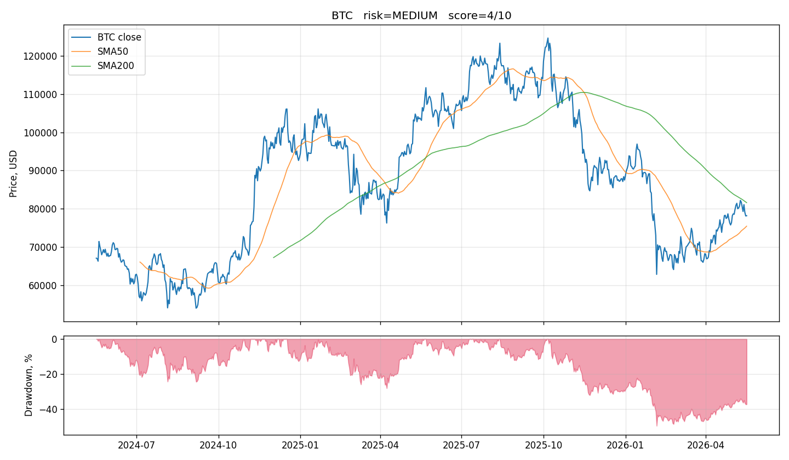

# btc-risk-brief

Простой собиратель риск-данных по биткоину (и другим криптоактивам) из
бесплатных публичных API. Запускается из терминала, печатает JSON / текст /
Markdown, рисует PNG-чарт. **Никаких API-ключей бирж, никаких вызовов LLM из
кода — оценку рисков делаешь ты сам или копируешь вывод в чат вроде
ChatGPT/Claude/Grok.**



> Связь по проекту / вопросы / баги — Telegram **[@y2026kk09](https://t.me/y2026kk09)**.

---

## Что считает

- Цена и доходности 1d / 7d / 30d / 90d / 365d
- **Терм-структура волатильности**: 7d / 30d / 90d / 180d (annualized)
- **Historical VaR 95% / 99%** и **Expected Shortfall** для 1-дневного убытка + worst-1d за 2 года
- RSI14, SMA50/200, position в 30/90/365-дневном диапазоне
- ATH за 2 года и drawdown от него, Max Drawdown за 2 года и его длительность
- **Fear & Greed** (текущий + 7d/30d средние)
- **Crypto macro**: BTC.D / ETH.D, total mcap, тренд stablecoins USDT/USDC (30d / 90d)
- **Деривативы (не Binance)**: funding rate и open interest с Bybit и OKX
- On-chain (только BTC): hashrate Δ30/90d, difficulty Δ30d, размер и комиссии мемпула
- Корреляции с традиционными рынками: BTC ↔ S&P 500, BTC ↔ DXY (30d/90d)
- Свежие BTC-новости — опционально, если задан токен CryptoPanic

На основе этого считается **светофор `low / medium / high`** (балльная эвристика
0..10) с топ-факторами, что именно сейчас гоняет риск.

## Источники (всё бесплатно, без API-ключей кроме одного опционального)

| источник | данные |
| --- | --- |
| [CryptoCompare](https://min-api.cryptocompare.com/) | daily OHLC за 2+ года, любой тикер |
| [Alternative.me](https://alternative.me/crypto/fear-and-greed-index/) | Fear & Greed индекс |
| [blockchain.com](https://www.blockchain.com/api) | hashrate, difficulty |
| [mempool.space](https://mempool.space/) | размер мемпула и комиссии sat/vB |
| [CoinGecko](https://www.coingecko.com/api/docs/v3) | BTC/ETH dominance, total mcap, история USDT/USDC supply |
| [Bybit v5](https://bybit-exchange.github.io/docs/v5/intro) | funding history и open interest BTC-perp |
| [OKX v5](https://www.okx.com/docs-v5/en/) | funding rate и open interest BTC-perp |
| [Yahoo Finance](https://query1.finance.yahoo.com/) | daily ^GSPC и DX-Y.NYB для корреляций |
| [CryptoPanic](https://cryptopanic.com/developers/api/) (опц.) | свежие BTC-заголовки, нужен бесплатный токен |

Ответы кэшируются в `risk_brief/cache/` (TTL 2–12 часов), чтобы не дёргать API
зря.

## Установка

```bash
git clone https://github.com/<you>/btc-risk-brief.git
cd btc-risk-brief
python3 -m venv .venv && source .venv/bin/activate
pip install -r requirements.txt
```

Минимум, что реально нужно — `pandas`, `numpy`, `requests`. `matplotlib` —
только если хочешь PNG-чарты. `python-dotenv` — только если используешь `.env`.

Опционально создай `.env` в корне (для CryptoPanic-заголовков):

```ini
CRYPTOPANIC_TOKEN=<свой_токен_с_cryptopanic.com>
```

## Использование

```bash
# одноразово, JSON + текст в терминал
python scripts/risk_brief.py

# только удобочитаемый текст
python scripts/risk_brief.py --text-only

# Markdown — копировать в чат-LLM с таблицами
python scripts/risk_brief.py --markdown

# любой тикер (CryptoCompare)
python scripts/risk_brief.py --symbol ETH

# PNG-чарт (нужен matplotlib)
python scripts/risk_brief.py --chart reports/btc.png

# каждый прогон складывать всё в папку (latest_*.{txt,md,json,png} + archive/)
python scripts/risk_brief.py --report-dir ~/Desktop/report

# цикл каждые N секунд (Ctrl+C — стоп)
python scripts/risk_brief.py --interval 3600

# показать последние 10 записей и выйти
python scripts/risk_brief.py --history 10
```

При каждом прогоне в `logs/risk_brief.jsonl` добавляется новая запись.
Если в этом файле уже есть предыдущая запись по тому же тикеру, в выводе
автоматически появится секция **«Changes since previous run»** — что
изменилось по score / price / drawdown / RSI / F&G / dominance / funding / corr.

## Расписание на macOS (launchd, опционально)

В `launchd/com.marci.risk_brief.plist` лежит шаблон, который запускает скрипт
2 раза в день (09:00 и 21:00 локально) и складывает отчёт в указанную папку.

Установка из корня репо:

```bash
PROJECT_DIR="$PWD"
REPORT_DIR="$HOME/Desktop/report"
mkdir -p "$REPORT_DIR"
sed -e "s|__PROJECT_DIR__|$PROJECT_DIR|g" \
    -e "s|__REPORT_DIR__|$REPORT_DIR|g" \
    launchd/com.marci.risk_brief.plist > ~/Library/LaunchAgents/com.marci.risk_brief.plist
launchctl unload ~/Library/LaunchAgents/com.marci.risk_brief.plist 2>/dev/null
launchctl load   ~/Library/LaunchAgents/com.marci.risk_brief.plist
launchctl start  com.marci.risk_brief   # принудительный прогон сейчас
```

Проверка: `launchctl list | grep marci`. Удалить — `launchctl unload …` и
удалить файл из `~/Library/LaunchAgents/`.

На Linux вместо launchd используй cron — добавь строку в `crontab -e`:

```
0 9,21 * * *  cd /path/to/btc-risk-brief && /usr/bin/python3 scripts/risk_brief.py --text-only --report-dir $HOME/Desktop/report
```

## Структура проекта

```
btc-risk-brief/
├── risk_brief/
│   ├── sources.py       # загрузка из бесплатных публичных API
│   ├── metrics.py       # расчёты + светофор-эвристика
│   ├── diff.py          # сравнение с предыдущим прогоном
│   └── cache/           # JSON-кэш ответов API (gitignored)
├── scripts/
│   └── risk_brief.py    # CLI: --markdown / --chart / --report-dir / --interval / --history
├── launchd/
│   └── com.marci.risk_brief.plist   # шаблон launchd-плиста
├── requirements.txt
├── LICENSE              # MIT
└── README.md
```

## Что **не** делает

- Не подключается к биржам Binance/Coinbase для торговли — ничего не покупает и не продаёт.
- Не зовёт LLM API из кода. Скрипт даёт данные, оценку рисков делает человек или чат-LLM.
- Не хранит приватные ключи. `.gitignore` прикрывает `.env`.
- Не даёт инвестиционных рекомендаций. Это образовательный/аналитический инструмент.

## Лицензия

[MIT](LICENSE).

## Контакты

Telegram: **[@y2026kk09](https://t.me/y2026kk09)** — туда писать по вопросам, багам, идеям.
